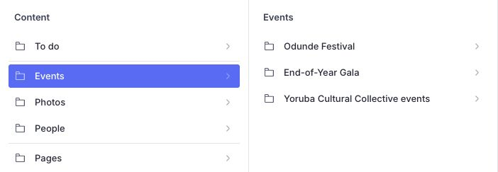
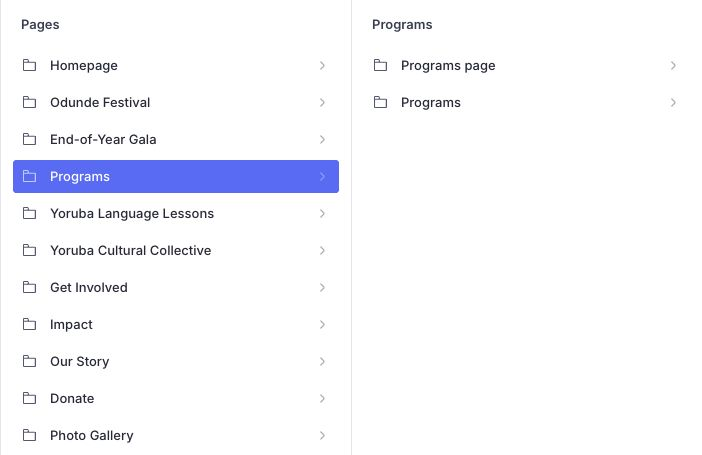
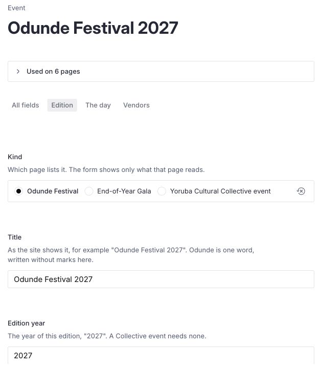
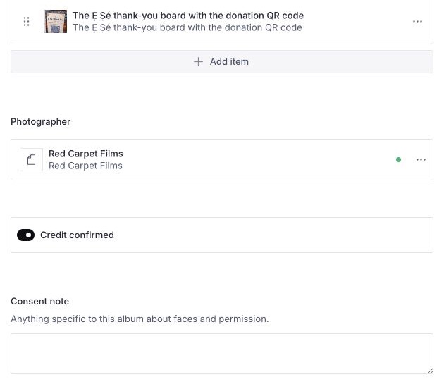
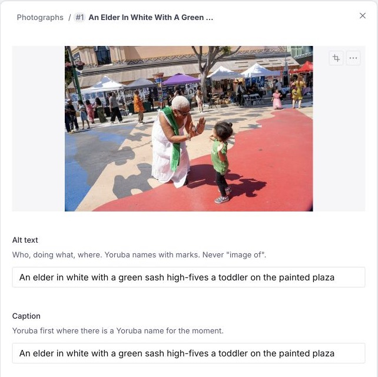
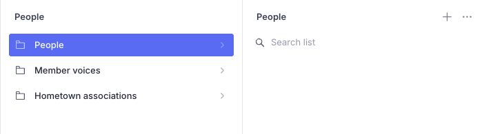
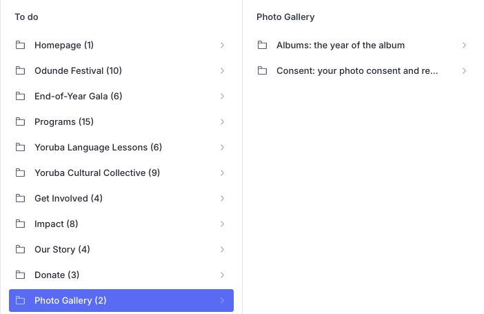
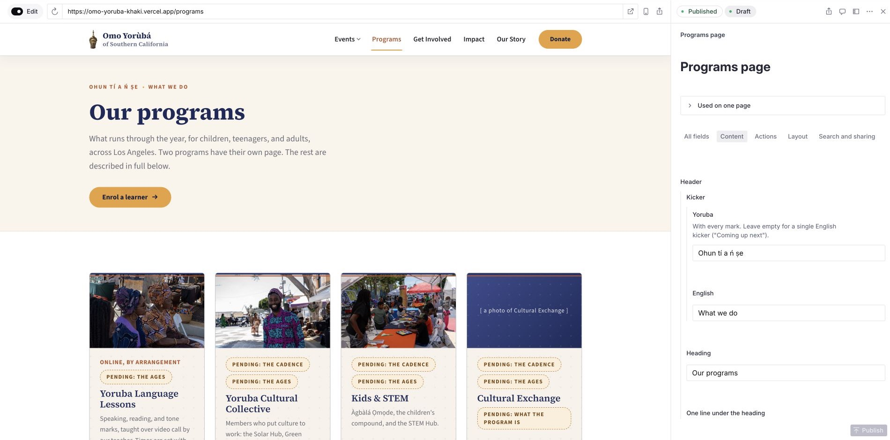

# Your guide to Studio

Welcome! Studio is where we keep our website up to date. Ask an administrator
whenever you are unsure.

Find this guide in the **Member guide** tab at the top of Studio.

## Get started

Open <a href="https://omo-yoruba-khaki.vercel.app/admin" target="_blank" rel="noopener">Studio</a> and sign in with your
invited account. Ask your administrator if you cannot sign in.

Search before adding something new to avoid duplicates. Changes save as a
**draft** while you work. **Publish** makes them available on the website. Leave
unfinished work as a draft, and wait for saving to finish before closing.

The screenshots show example items. Your lists and details may differ.

Choose a section on the left, then the list you need beside it.

## Edit a page

Open **Pages** and choose the page you want. Programs, Get Involved and Impact
open another list: choose the entry ending in **page** for the page's text, or
one of the lists beside it for its programs, ways to get involved or partners.

Choose **Programs page** to edit the page's text, or **Programs** to edit its list.

## Add an event

1. Open **Events**. For the festival or Gala, choose its name, then **Editions**.
   For the Collective, choose **Yoruba Cultural Collective events**.
2. Start a new item. Add the title, dates, venue and summary. Festival and Gala
   editions also need an **Edition year**. Times are in Los Angeles time.
3. Add confirmed details in the other tabs. The Gala's ticket tiers, sponsor
   levels and honorees have their own lists: select the matching **Edition**
   on each item.
4. Keep the event as a draft until its agreed announcement day, then **Publish**.
   Publishing is manual; it is not scheduled for you.

A Collective event needs a start date to appear on the site.

The tabs group an edition's details. Start with its title and year.

## Add an album

1. Open **Photos → Albums** and start a new album. Add its **Title**, then
   generate the **Web address** once. Keep an existing album's address unchanged.
2. Choose the matching **Edition** for event photographs. Add a confirmed
   **Date** when there is no edition or the exact day matters.
3. Choose **Add item** under **Photographs** to add a photograph. Keep them in
   the order you want them shown. Give each one **Alt text** describing who is
   doing what and where, plus a **Caption**.
   The first photograph is the cover unless you choose another **Cover**.
4. To add a video, choose **Add item** under **Videos**. Give it a **Title**
   and paste the **YouTube address** that the video's Share button gives. A
   **Still** and **Made by** are optional: without a still, the album's cover
   or first photograph shows under the play mark. Videos appear above the
   photographs, and the first one also appears on the event's page. Nothing
   loads from YouTube until a visitor presses play.
5. Choose the **Photographer**. Tick **Credit confirmed** only once the owner
   confirms the credit. Add a **Consent note** for permission specific to this
   album. Check it, then **Publish**.

Add item sits below the photographs. The credit and permission fields follow it.

Use only photographs the organization has permission to publish, including for
children shown. If unsure, keep a draft and ask. An album needs a photograph to
appear in the gallery.

Edit existing photographs in place. Removing and adding one again can break
shared links.

Open a photograph to add alt text and a caption. Photograph: Red Carpet Films.

## Add a person

1. Open **People → People**. Use the create button at the top right of the list.
2. Add their **Name**, **Role** and **Short bio**. Choose the right **Group**:
   board, staff or volunteers. This lets Our Story list them.
3. A portrait is optional. If you add one, confirm permission and include alt
   text and a caption.
4. Check their details and choose **Publish**.

For the Language Lessons teacher, leave **Group** empty and select that person
under **Pages → Yoruba Language Lessons → Teacher**.

Use the create button at the top right, beside the menu.

## Clear a To do item

1. Open **To do**, choose a page, then the item that needs attention.
2. Open the page or listed document and fill the missing information.
3. Check it and **Publish** when it is ready.

**Still to add** asks for a new item. **Wording to check** asks for a text
correction. To do also reads drafts: a row disappearing does not mean your
changes are published. Check the public page too.

Choose a page to see what it still needs. Counts change as you fill in details.

## Before you publish

Use confirmed facts and short sentences. Keep the marks on Yorùbá words and
names. Leave unknown details empty; if a required detail is missing, keep a
draft. Fix field errors and ask about warnings you do not understand.

To preview the page you are editing, open the **Used on** row above the fields and
choose a page link. This opens **Presentation**. Use the viewport button to
check a narrow screen too. When ready, choose **Publish** at the bottom right,
then check the public website.

The preview sits beside the form. This example has no changes to publish, so
the Publish button is dimmed. <a href="screenshots/member-guide/preview-and-publish.jpg" target="_blank" rel="noopener">Open the larger image in a new tab</a>.

## When to ask for help

Ask an administrator about locked fields, removing or unpublishing an item, or
changes still missing after a minute. Include the page name and any message.

Administrators handle **Organization details**, the **Inbox**, and the switches
for gallery visibility, Our Story's timeline and Gala awards. **Coming soon**
hides album photographs and videos, including on event pages, but leaves
photographs added directly to pages. Tell an administrator which pages need attention if
permission changes.

Your account may still access enquiries and subscriber details outside these
menus. Keep that information private; share it only with those responsible for
handling it.
